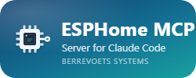

# ESPHome MCP Server — Home Assistant Add-on



[](LICENSE)

MCP (Model Context Protocol) server that exposes ESPHome operations as
tools for [Claude Code](https://claude.ai/code). Runs as a Home
Assistant add-on with direct filesystem access — no SSH required.

## Quick Start

1. Add this repository as a custom add-on repository in Home Assistant:

   **Settings > Add-ons > Add-on Store > ... (menu) > Repositories**

   ```text
   https://github.com/bberrevoets/ha-addon-esphome-mcp
   ```

2. Install and start the **ESPHome MCP Server** add-on.

3. Check the add-on logs for the auto-generated auth token.

4. Set `ESPHOME_MCP_TOKEN` in your shell environment.

5. Add to `.mcp.json` in your ESPHome project:

   ```json
   {
     "mcpServers": {
       "esphome": {
         "type": "http",
         "url": "http://<your-ha-host>:8099/mcp",
         "headers": {
           "Authorization": "Bearer ${ESPHOME_MCP_TOKEN}"
         }
       }
     }
   }
   ```

6. Restart Claude Code and verify with `/mcp`.

## Tools

| Tool | Description |
| ---- | ----------- |
| `esphome_list_devices` | List device configs with names |
| `esphome_validate` | Validate a device YAML config |
| `esphome_compile` | Compile firmware (background; inline result or poll handle) |
| `esphome_flash` | OTA flash a device (background; refuses firmware downgrades unless allowed) |
| `esphome_build_status` | Poll the latest background compile/flash |
| `esphome_logs` | Get recent device logs (15 s network snapshot) |
| `esphome_push_files` | Write YAML configs to HA |
| `esphome_pull_files` | Read YAML configs from HA |
| `esphome_push_fonts` | Write font files (base64) to HA |
| `esphome_pull_fonts` | Read font files (base64) from HA |

## ESPHome version

The add-on compiles with the ESPHome version of its base image
(`ghcr.io/esphome/esphome:<tag>` in `esphome-mcp/build.yaml`), bumped with
every add-on release. `esphome_list_devices` prints that version, and
`esphome_flash` first queries the device's running firmware: if it is
**newer** than the add-on, the flash is refused (it would downgrade the
device) unless `allow_downgrade=true` is passed.

Flashing and logs always go over the network (`--device OTA`), resolved
from the device config (`use_address`, static IP or `<name>.local`);
serial upload is not supported.

## Architecture

```text
Claude Code (desktop)  --HTTP-->  HA Add-on (MCP Server)  --local-->  ESPHome CLI
                                       |
                                  /config/esphome/  (direct filesystem access)
```

See [esphome-mcp/DOCS.md](esphome-mcp/DOCS.md) for full documentation.

## Development

Test a change on a real Home Assistant host without releasing it:

- `bash scripts/deploy-dev.sh` copies the working tree to `/addons/esphome-mcp`
  on the HA host over SSH and installs/rebuilds it as **ESPHome MCP Server
  (dev)** on port 8098, next to the store version. `--sync-only`, `--logs` and
  `--remove` are available; `HA_SSH_HOST` / `HA_DEV_PORT` override the defaults.
- Or add a branch as a second add-on repository in HA:
  `https://github.com/bberrevoets/ha-addon-esphome-mcp#<branch>` (change the
  host port under *Network* before starting).

The icon and logo are rendered from `esphome-mcp/*.svg` with
`python scripts/render-icons.py`. See [CLAUDE.md](CLAUDE.md) for the release
checklist.

## License

[MIT](LICENSE) — Berrevoets Systems
